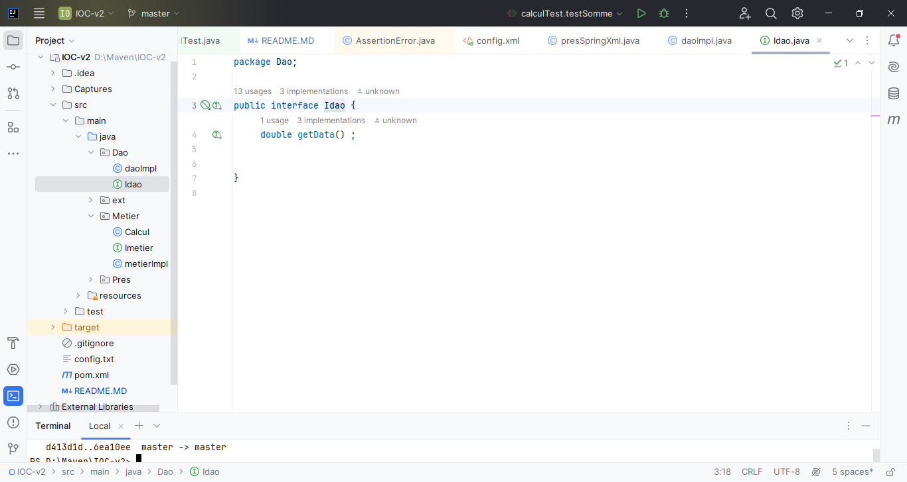
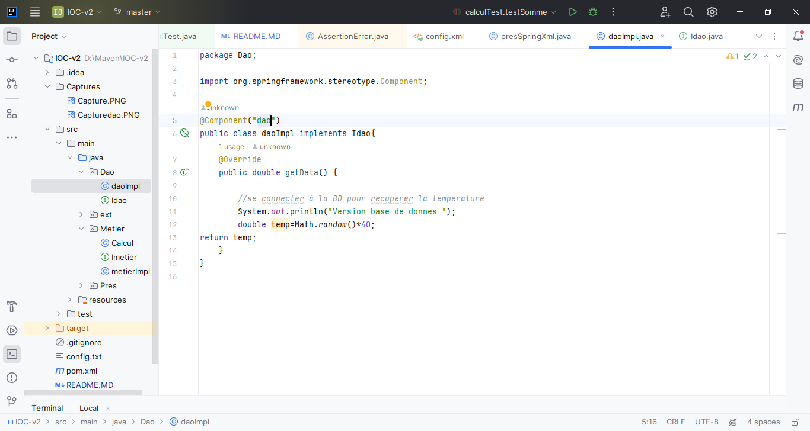
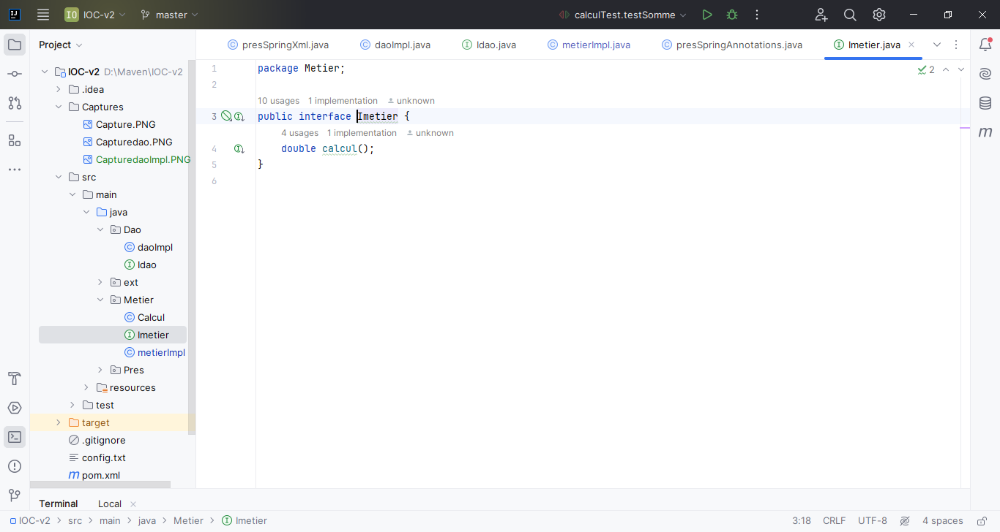
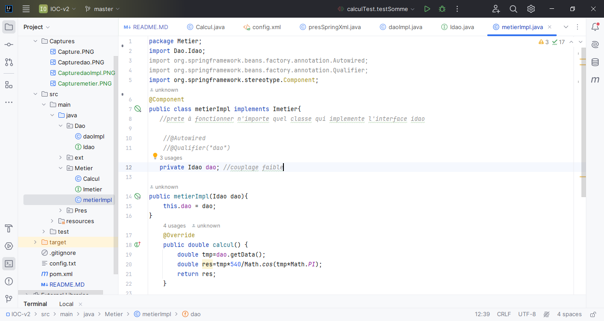
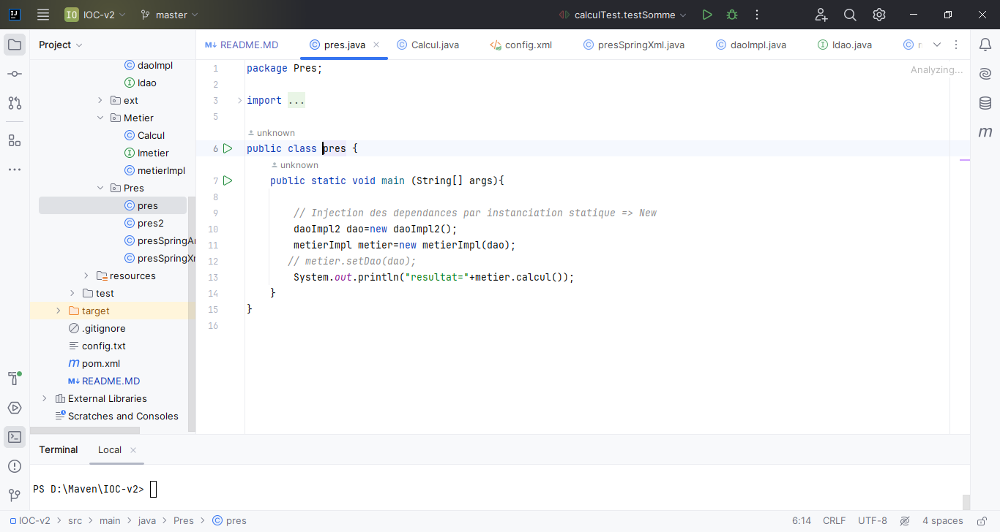
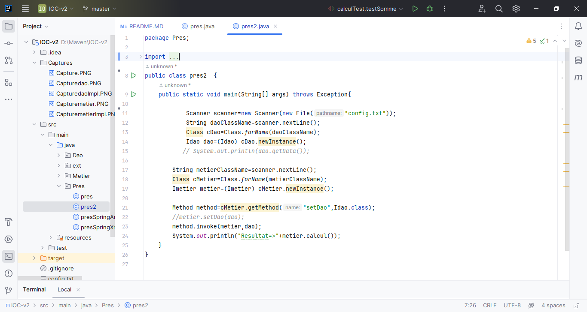
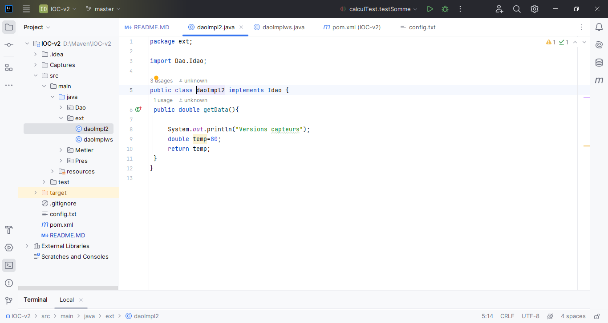
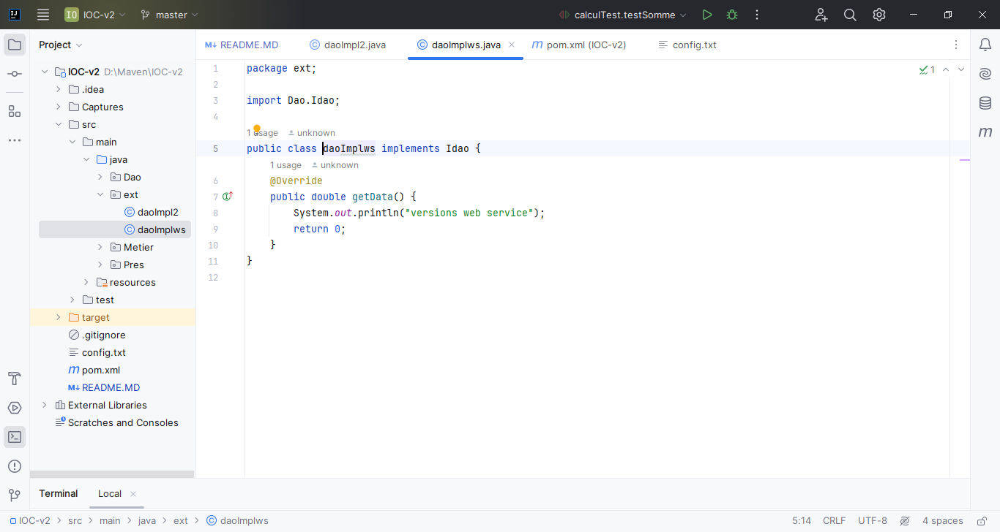
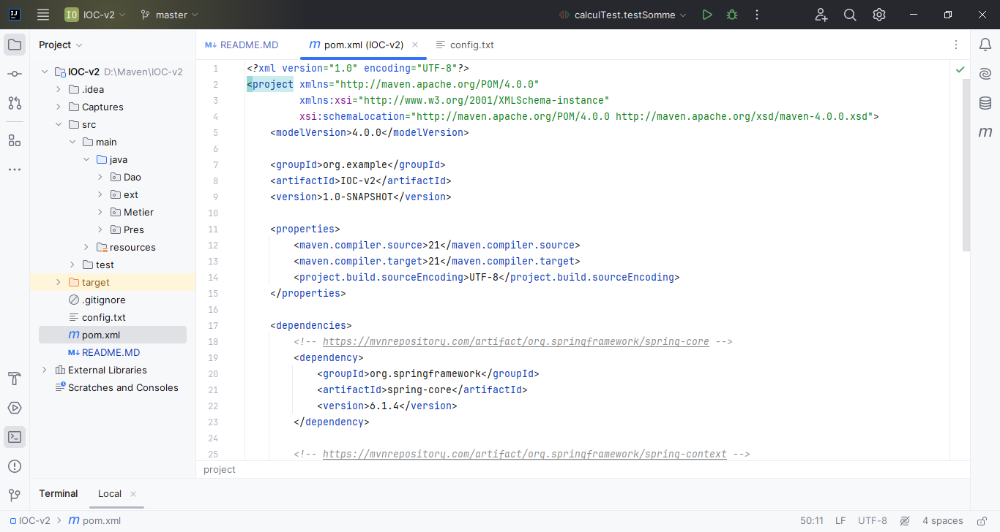

<h3>Compte Rendu</h3>

<h5>on crée un dossier "Dao" dans laquel on crée une interface "Idao" , et une classe qui implémente cette interface "daoImpl"></h5>

<h5>on crée un dossier "Metier" dans laquel on crée une interface "Imetier" , et une classe qui implémente cette interface "metierImpl"></h5>

<h5 style="color:blue;">Voici l'interface Idao</h5>

<h5 style="color:blue;">Voici la classe daoImpl</h5>

<h5 style="color:blue;">Voici l'interface Imetier</h5>

<h5 style="color:blue;">Voici la classe metierImpl</h5>

<h5>Pour créer des application fermée à la modification et ouvertes à
l’extension on fait le couplage faible : </h5>
<h4 style="color:blue;">"Voir la classe metierImpl"</h4>

<h5>on a deux types d'inejction de dependances : statique et dynamique</h5>
<h4>Pour l'injection de dependances par instanciation statique on crée une classe "pres" dans le dossier "Pres"></h4>

<h4>Pour l'injection de dependances par instanciation dynamique on crée un fichier texte "config.txt"></h4>

<h4>Aprés on crée une classe "pres2" dans le dossier "Pres"></h4>

<h4>On ajoute un autre dossier "ext" qui contient deux classe qui contient deux versions de la classe "daoImpl" ></h4>
<h4 style="color:blue;">Voici la premiére version "daoImpl2"></h4>

<h4 style="color:blue;">Voici la deuxiéme version "daoImplws"></h4>

<h4>On peut aussi faire l'injection de dependances avec spring></h4>
<h4>Un projet maven est un projet qui contient "pom.xml" dans lequel on ajoute spring maven dependencies</h4>

