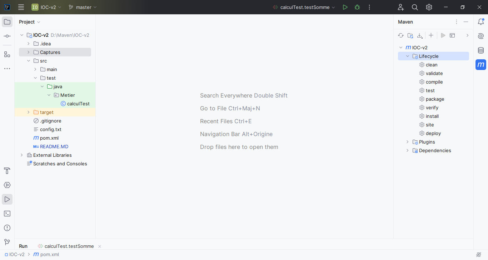

<h3>Compte Rendu</h3>

<h5>on crée un dossier "Dao" dans laquel on crée une interface "Idao" , et une classe qui implémente cette interface "daoImpl"></h5>

<h5>on crée un dossier "Metier" dans laquel on crée une interface "Imetier" , et une classe qui implémente cette interface "metierImpl"></h5>

<h5 style="color:blue;">Voici l'interface Idao</h5>

<h5 style="color:blue;">Voici la classe daoImpl</h5>

<h5 style="color:blue;">Voici l'interface Imetier</h5>

<h5 style="color:blue;">Voici la classe metierImpl</h5>

<h5>Pour créer des application fermée à la modification et ouvertes à
l’extension on fait le couplage faible : </h5>
<h4 style="color:blue;">"Voir la classe metierImpl"</h4>

<h5>on a deux types d'inejction de dependances : statique et dynamique</h5>
<h4>Pour l'injection de dependances par instanciation statique on crée une classe "pres" dans le dossier "Pres"></h4>

<h4>Pour l'injection de dependances par instanciation dynamique on crée un fichier texte "config.txt"></h4>

<h4>Aprés on crée une classe "pres2" dans le dossier "Pres"></h4>

<h4>On ajoute un autre dossier "ext" qui contient deux classe qui contient deux extensions de la classe "daoImpl" ></h4>
<h4 style="color:blue;">Voici la premiére extension "daoImpl2"</h4>

<h4 style="color:blue;">Voici la deuxiéme extension "daoImplws"</h4>

<h4>On peut aussi faire l'injection de dependances avec spring></h4>
<h4>On commence par la version XML</h4>
<h4>Un projet maven est un projet qui contient "pom.xml" dans lequel on ajoute spring maven dependencies</h4>
<h4>ici on ajoute spring core , spring context et spring beans</h4>

<h4>Dans le dossier ressources on ajoute un fichier xml "config.xml" dans lequel on fait l'injection de dependances </h4>

<h4>Aprés on ajoute une classe dans le dossier "Pres" qui s'appelle "presSpringXml"</h4>

<h4>Maintenant la version Annotations</h4>
<h4>Voir la classe "daoImpl" et la classe "metierImpl"</h4>
<h4>on ajoute une classe "presSpringAnnotations" dans le dossier "Pres"</h4>

<h4>pour faire des tests unitaires on ajoute "junit" dans le fichier "pom.xml"</h4>

<h4>pour montrer ce tests on ajoute une classe "Calcul" dans "Metier"</h4>

<h4>On ajoute aussi une classe "Metier.calculTest dans "test"</h4>

<h4>Pour verifier on execute la fonction "testSomme"</h4>

<h4>Pour trouver les commandes de maven sur intellij: on clique sur maven aprés sur lifecycle</h4>

<h3>Le framework Spring peut faire l'injection des dependances et l'inversion de controle(par annotations) </h4>
